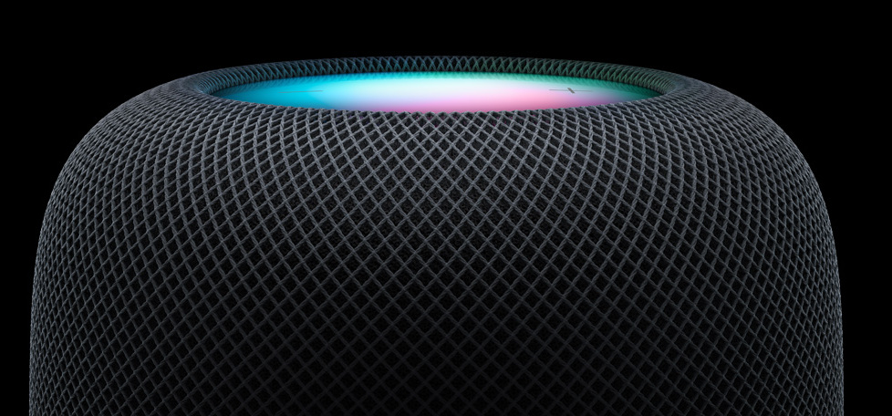
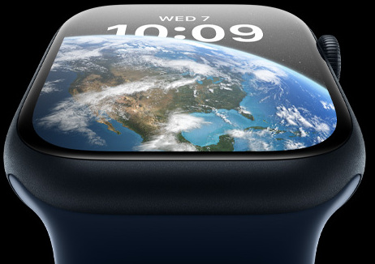

# Steps to follow

# Navbar

HTML:

```

 <nav class="navbar">
      <ul class="navbar-list">
        <a
          href="#"
          class="nav-item"
        >
          </a>
        <a
          href="#"
          class="nav-item"
          >Store</a
        >
        <a
          href="#"
          class="nav-item"
          >Mac</a
        >
        <a
          href="#"
          class="nav-item"
          >iPad</a
        >
        <a
          href="#"
          class="nav-item"
          >iPhone</a
        >
        <a
          href="#"
          class="nav-item"
          >Watch</a
        >
        <a
          href="#"
          class="nav-item"
          >AirPods</a
        >
        <a
          href="#"
          class="nav-item"
          >Tv & Home</a
        >
        <a
          href="#"
          class="nav-item"
          >Only on Apple</a
        >
        <a
          href="#"
          class="nav-item"
          >Accessories</a
        >
        <a
          href="#"
          class="nav-item"
          >Support</a
        >
        <a
          href="#"
          class="nav-item"
        >
          </a>
        <a
          href="#"
          class="nav-item"
        >
          </a>
      </ul>
    </nav>
```

CSS:

```
* {
  margin: 0;
  padding: 0;
  font-family: "SF Pro Text", "Myriad Set Pro", "SF Pro Icons", "Helvetica Neue",
    "Helvetica", "Arial", sans-serif;
  color: #f5f5f7;
}

body {
  background-color: #000;
}

a {
  color: inherit;
  text-decoration: none;
}

.navbar-list {
  display: flex;
  align-items: center;
  justify-content: center;
  background-color: #0d0c0c;
  padding: 15px;
}

.nav-item {
  color: #c0c0c0;
  font-size: 12px;
  font-weight: 400;
  margin: 0 20px 0 20px;
}

.nav-item:hover {
  color: #f5f5f7;
}

.nav-image {
  max-width: 20px;
  max-height: 20px;
}
```

2. Main Section

HTML:

```
<section class="main-section">
      <h2 class="heading">
        Introducing the new <br />
        MacBook Pro and Mac mini.
      </h2>
      <div class="announce-button">
        <a class="button-text">
          Watch the announcement
          
        </a>
      </div>
    </section>
```

CSS:

```
.main-section {
  height: 65vh;
  display: flex;
  flex-direction: column;
  align-items: center;
  justify-content: center;
}

.heading {
  z-index: 2;
  text-align: center;
  font-size: 55px;
  line-height: 1.1;
  font-weight: 600;
  letter-spacing: -0.005em;
}

.play-button {
  max-height: 15px;
  max-width: 15px;
}

.announce-button {
  border: none;
  font-size: 17px;
  padding: 15px 1px;
  background-color: rgba(0, 0, 0, 0);
  background-image: linear-gradient(
    107deg,
    rgb(233, 95, 51),
    rgb(204, 24, 198),
    rgb(70, 152, 255),
    rgb(37, 101, 244)
  );
  border-radius: 980px;
  margin: 30px;
  cursor: pointer;
}

.button-text {
  border: 2px solid transparent;
  border-radius: 980px;
  background-clip: padding-box;
  background-color: #000;
  color: #f5f5f7;
  font-size: 17px;
  line-height: 1.2;
  font-weight: 400;
  padding: 13px 12px 13px 12px;
}
```

3. Secondary Sections:

HTML:

```
<section class="secondary-section">
      <h2 class="heading">MacBook Pro</h2>
      <h3 class="sub-heading">Supercharged by M2 Pro and M2 Max.</h3>
      <p class="callout">Available starting 1.24</p>
      <div class="links">
        <a
          class="links-text"
          href="#"
          >Learn more ></a
        >
        <a
          class="links-text"
          href="#"
          >Order now ></a
        >
      </div>
      
    </section>
    <section class="secondary-section">
      <h2 class="heading">Mac Mini</h2>
      <h3 class="sub-heading">Supercharged by M2 Pro and M2 Max.</h3>
      <p class="callout">Available starting 1.24</p>
      <div class="links">
        <a
          class="links-text"
          href="#"
          >Learn more ></a
        >
        <a
          class="links-text"
          href="#"
          >Order now ></a
        >
      </div>
      
    </section>
    <section class="secondary-section">
      <h2 class="heading">HomePod</h2>
      <h3 class="sub-heading">Profound sound.</h3>
      <p class="callout">Available starting 2.3</p>
      <div class="links">
        <a
          class="links-text"
          href="#"
          >Learn more ></a
        >
        <a
          class="links-text"
          href="#"
          >Order now ></a
        >
      </div>
      
    </section>
```

CSS:

```
.secondary-section {
  height: 70vh;
  display: flex;
  flex-direction: column;
  align-items: center;
  justify-content: center;
}

.sub-heading {
  font-size: 28px;
  line-height: 1.10722;
  font-weight: 400;
  letter-spacing: 0.004em;
  margin-top: 6px;
  text-align: center;
  z-index: 2;
}

.callout {
  font-size: 21px;
  line-height: 1.2;
  font-weight: 400;
  letter-spacing: 0.011em;
  color: #6e6e73;
  margin-top: 15px;
}

.links-text {
  text-decoration: none;
  color: #2997ff;
  font-size: 21px;
  line-height: 1.4;
  font-weight: 400;
  margin: 10px;
}
```

4. Grid Section

HTML:

```
<section class="grid">
      <div class="grid-item">
        <h2 class="heading">
          Creativity and <br />
          community.
        </h2>
        <h3 class="sub-heading">Woven Together</h3>
        <p class="callout-watch">
          Explore the new Black Unity watch <br />
          band and matching face.
        </p>
        <div>
          <a class="links-text">Learn more ></a>
          <a class="links-text">Buy ></a>
        </div>
        
      </div>
      <div class="grid-item">
        <h2 class="heading">
          
          WATCH
        </h2>
        <h3 class="sub-heading-watch">SERIES 8</h3>
        <p class="callout-watch">A healthy leap ahead.</p>
        <div>
          <a class="links-text">Learn more ></a>
          <a class="links-text">Buy ></a>
        </div>
        
      </div>
      <div class="grid-item">
        <h2 class="heading">iPhone 14 Pro</h2>
        <h3 class="sub-heading">Pro. Beyond.</h3>
        <div>
          <a class="links-text">Learn more ></a>
          <a class="links-text">Buy ></a>
        </div>
        
      </div>
      <div
        class="grid-item"
        id="white-bg"
      >
        <h2
          class="heading"
          id="black-text"
        >
          iPhone 14
        </h2>
        <h3
          class="sub-heading"
          id="black-text"
        >
          Big and bigger.
        </h3>
        <div>
          <a class="links-text">Learn more ></a>
          <a class="links-text">Buy ></a>
        </div>
        
      </div>
    </section>
```

CSS:

```
.grid {
  display: grid;
  grid-template-columns: repeat(2, 1fr);
}

.grid-item {
  display: flex;
  align-items: center;
  justify-content: center;
  flex-direction: column;
  border: white solid 10px;
  max-width: 50vw;
}

.callout-watch {
  text-align: center;
  margin: 20px;
}

.apple-logo {
  max-width: 50px;
  max-height: 50px;
}

.sub-heading-watch {
  letter-spacing: 1px;
  color: #880808;
}

#white-bg {
  background-color: white;
}

#black-text {
  color: black;
}

.grid-images {
  max-width: 45vw;
}
```

5. Footer

HTML:

```
<footer>
      <div class="footer">
        <p class="footer-text">Developed by fcaramez @ Ironhack</p>
      </div>
    </footer>
```

CSS:

```
.footer-text {
  color: #c0c0c0;
  text-align: center;
  padding: 20px;
}
```
